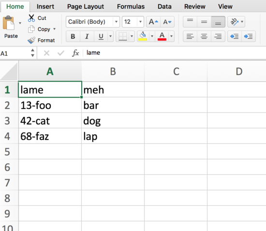
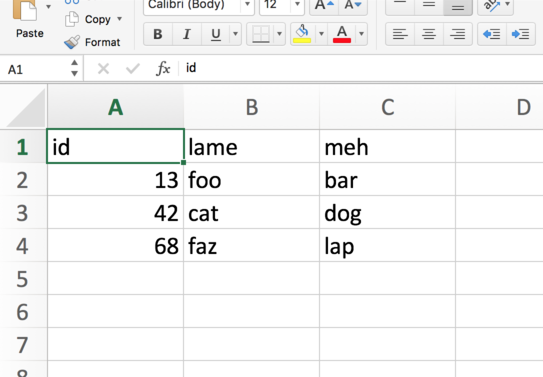

# hellocsv
>CSV hacking

## Usage

```
ruby format.rb poorlyformatted.csv  > better.csv

cat poorlyformatted.csv
lame,meh
13-foo,bar
42-cat,dog
68-faz,lap

cat better.csv
id,lame,meh
13,foo,bar
42,cat,dog
68,faz,lap
```


## Hacking

```
lame	meh
13-foo	bar
42-cat	dog
68-faz	lap
```



```
od -c poorlyformatted.csv
0000000  357 273 277   l   a   m   e   ,   m   e   h  \r   1   3   -   f
0000020    o   o   ,   b   a   r  \r   4   2   -   c   a   t   ,   d   o
0000040    g  \r   6   8   -   f   a   z   ,   l   a   p                
0000054

# https://unix.stackexchange.com/a/32059/173557
tmpfile=$(mktemp)
tr '\r' '\n' < poorlyformatted.csv > "$tmpfile"
mv "$tmpfile" poorlyformatted.csv

od -c poorlyformatted.csv
0000000  357 273 277   l   a   m   e   ,   m   e   h  \n   1   3   -   f
0000020    o   o   ,   b   a   r  \n   4   2   -   c   a   t   ,   d   o
0000040    g  \n   6   8   -   f   a   z   ,   l   a   p                
0000054

# http://www.markhneedham.com/blog/2012/09/03/a-rogue-357273277-utf-8-byte-order-mark/
tmpfile=$(mktemp)
awk '{ if(NR==1) sub(/^\xef\xbb\xbf/,""); print }' poorlyformatted.csv > "$tmpfile"
mv "$tmpfile" poorlyformatted.csv

od -c poorlyformatted.csv
0000000    l   a   m   e   ,   m   e   h  \n   1   3   -   f   o   o   ,
0000020    b   a   r  \n   4   2   -   c   a   t   ,   d   o   g  \n   6
0000040    8   -   f   a   z   ,   l   a   p  \n                        
0000052

ruby format.rb poorlyformatted.csv  > better.csv
```



## Links

* http://www.markhneedham.com/blog/2012/09/03/a-rogue-357273277-utf-8-byte-order-mark/
* https://unix.stackexchange.com/questions/32001/what-is-m-and-how-do-i-get-rid-of-it
